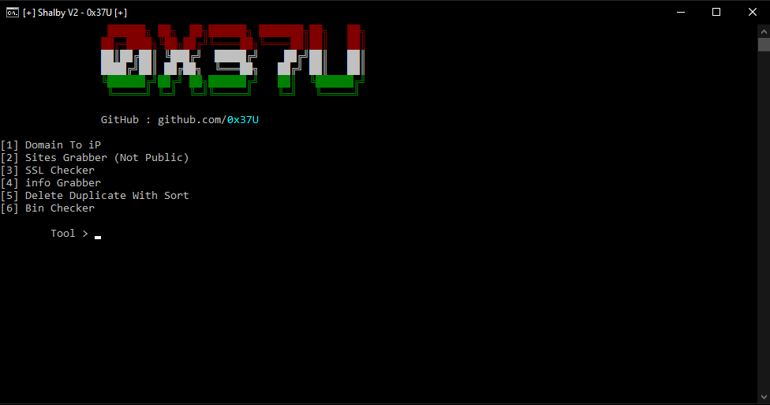

# Shalby V2

```bash

$ python 3.x
$ python main.py

```
```python
pip install requests
pip install colorama
```
# How to use
 - Run Script
 - Select Tool Number
 - And Enjoy !





# What's New

• speed up
• Bug fixes
<h1>More Tools In My [Facebook][facebook]</h1>
[facebook]: https://www.facebook.com/Amr.v7